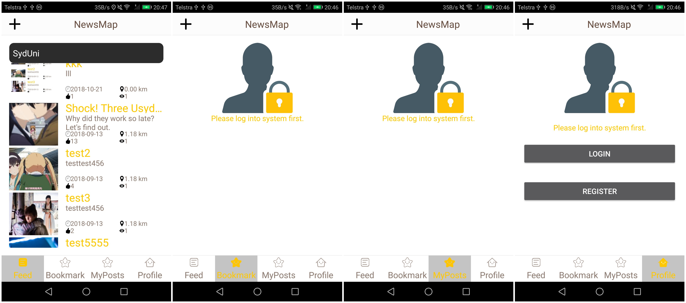
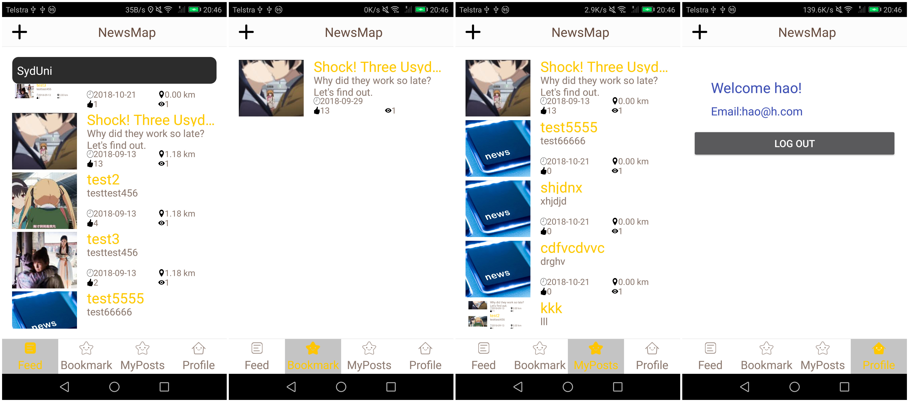
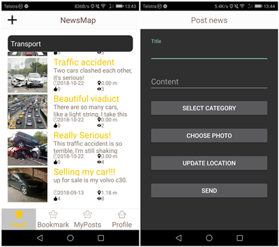
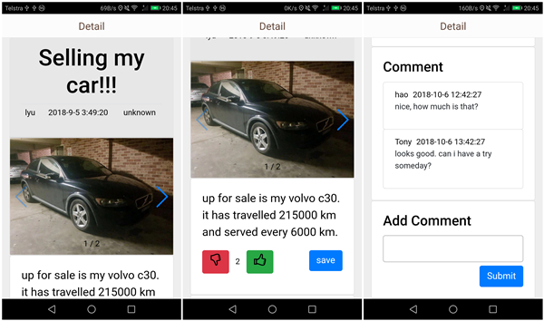

# COMP5216_Mobile_Computing

Android Projects of COMP5216 Mobile Computing  
This project is completed by Hao Wang and me.  
You can find the backend project at [here](https://github.com/StoneLyu/COMP5216_Nodejs_Backend)

---

## Introduction

Almost all of the social networks are designed based on the relationships between every people. But sometimes, to some social demands, the first thing need to be considered is not the relationship between the other people and me, but the distance between us. Like second-hand selling, car crash reporting, first aid and so on.  
So, we designed this *Instant News Application* based on the location.

for more infomation, you can check [project report](./COMP5216_Project_Report.pdf)

screenshots:
before login:

after login:

looking through by categories & create news:

news details:

### About APP

- **Target**: Instant News Application (即时新闻分享平台)
- **Problem**: The newspapers and popular social networks are controlled by a few magnate in the world. The magnates can decide that what u can or can't know through present news reporting. It is very hard for ordinary people to get the truth of an event. Even the president of US, Trump, is always attacked by fake news.
- **Solution**: Let the people who near the truth to tell. We are going to build a platform that can provide the instant news from the people on the scene to the people sitting behind the screen.
- **Implement**: Anyone can tell others the news happend nearby by uploading text, picture or video. Such as the car crash, Conflagration and even terrist attack. For each news, readers can press `approval` or `disapproval` to decide whether this news should be known by others. We will let users know the highst voted news. Then people can look through the nearby news by the distance or category.
- **Technique Detail**:
    - Frontend: Android client APP
	- Backend: `node.js` (`KOA`)
	- Connection: RESTful API
	- DB: `MongoDB`
		- News collection
			- `_id`
			- `title`
			- `uploaderId`
			- `time`
			- `location`
			- `contentUrl`
			- `description`
			- `category`
			- TBC...
		- category collection
			- `_id`
			- `name`
			- `fatherCategoryId`
		- user collection
			- `_id`
			- `username`
			- `email`
			- `password`
			- `favCategory`
		- bookmark collection
			- `_id`
			- `userId`
			- `newsId`
			- `savedTime`
		- comment collection
			- `_id`
			- `userId`
			- `newsId`
			- `comment`
			- `commentTime`
- Function Points:
	- Looking through news by categories or location(default)
	- Mark or save news (need to login)
	- Upload news (need to login)
	- Comment (need to login)
	- Login and register